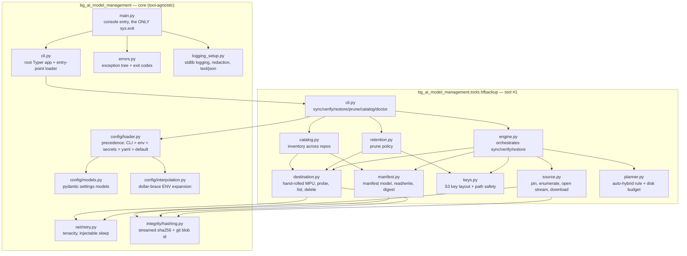
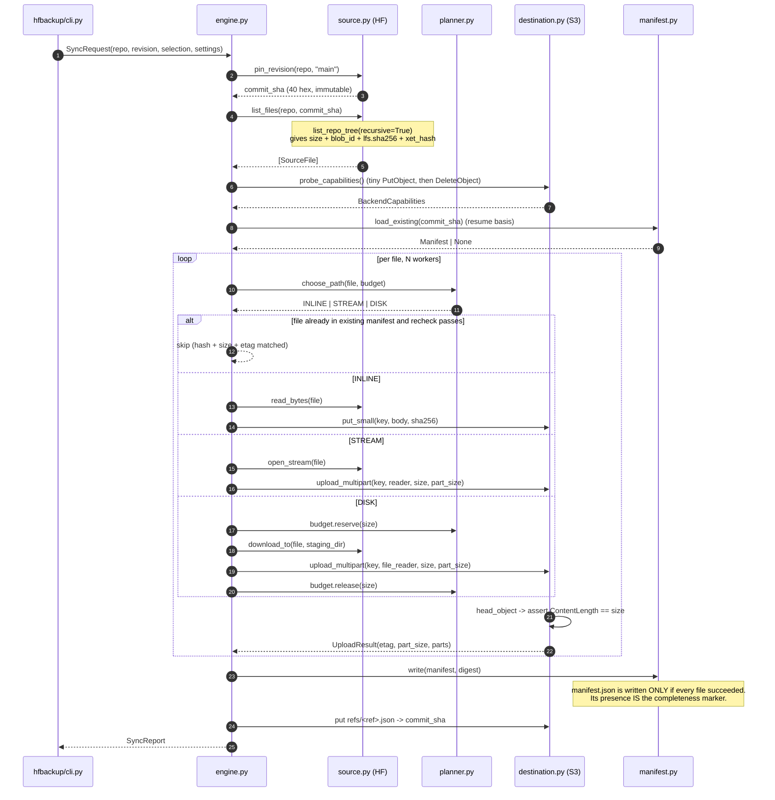
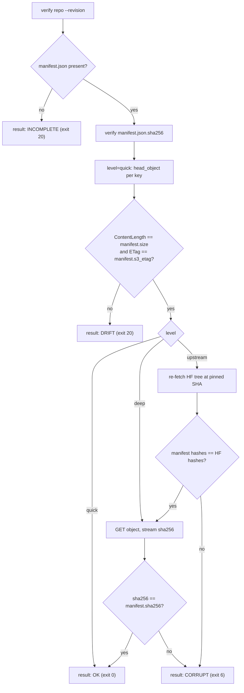
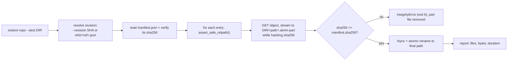
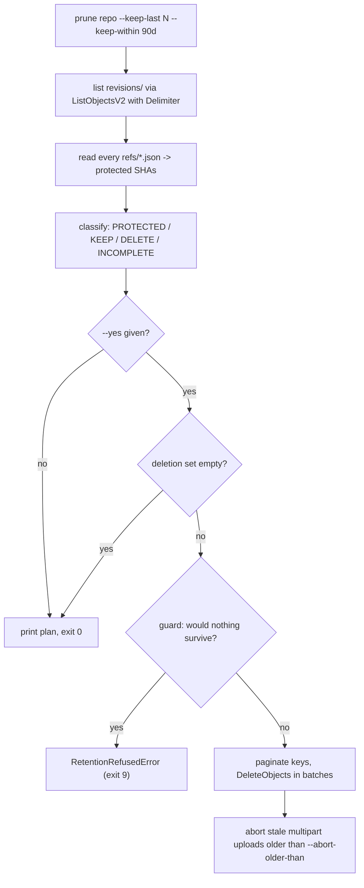
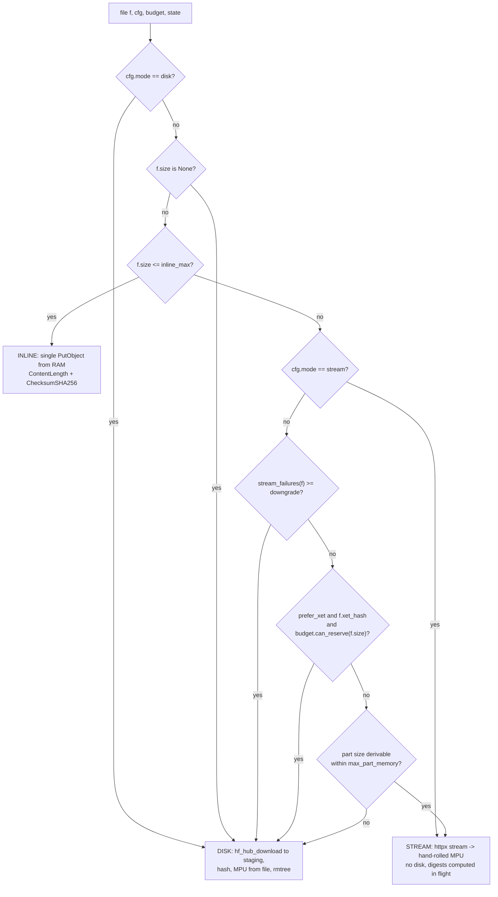
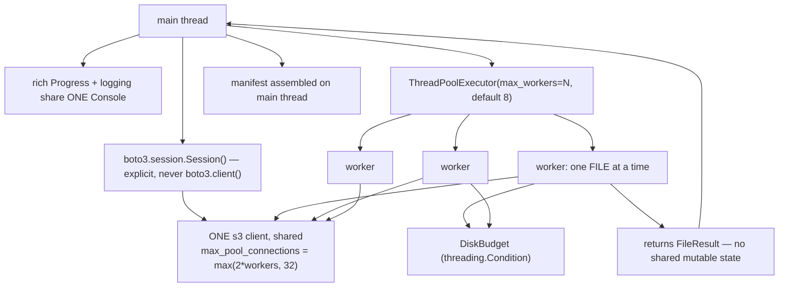
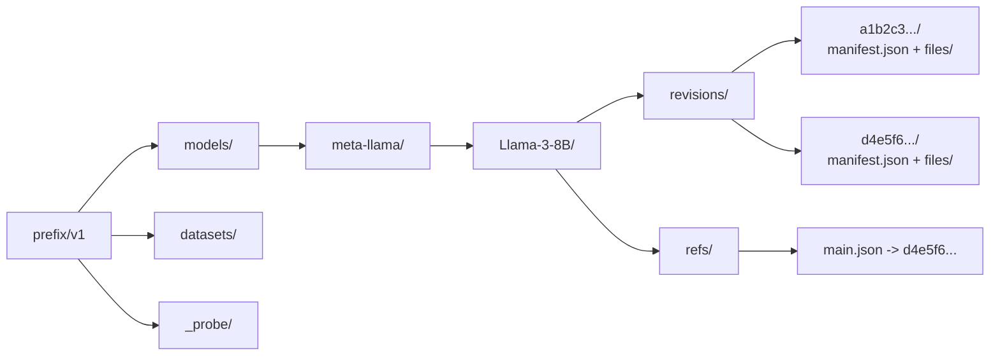

# AI Model Management (`aimm`) — Architecture

Status: binding design for the first implementation
Date: 2026-07-20
Target platform: Python 3.14 (floor 3.12), published as a PyPI wheel; Windows development host

> Language rule for this repository: **everything is English** — identifiers, docstrings,
> log messages, CLI help, and all prose in `README.MD`, `docs/` and the ADRs.

---

## 1. Goals and non-goals

### 1.1 Goals

- **`aimm` is a toolkit, not a single script.** Tool #1 (`hf-backup`) is the first of many
  building blocks for AI model development. The architecture must make tools #2..#N cheap
  and obvious.
- **Tool #1 covers the full lifecycle:** `sync`, `verify`, `restore`, `prune`, `catalog`,
  `doctor`.
- **Reproducible backups.** A backup is bound to an immutable commit SHA. Two runs against
  the same SHA produce the same result, and a push to `main` between enumeration and
  transfer cannot produce a torn snapshot.
- **Auto-hybrid transfer.** Hugging Face to S3 without touching disk where that is safe;
  disk buffering where it is not. Either extreme can be forced by flag.
- **All backend presets are equal-ranked:** MinIO (self-hosted), Ceph RGW, AWS S3,
  Cloudflare R2, Wasabi. MinIO is the integration-test target.
- **Integrity is provable, not assumed.** We compare against Hugging Face's own checksums,
  not against ETags.
- **Models *and* datasets.**

### 1.2 Non-goals

- **No built-in scheduler.** `aimm` is a process with deterministic exit codes and
  machine-readable `--json` output. Cron, systemd timers and Kubernetes CronJobs call it.
  The scheduling hooks are exit codes, JSON and `--run-id` — nothing more.
- **No plugin framework.** The extension point is a setuptools entry point that yields a
  `typer.Typer` object. Four lines of loader code, no registry, no dependency injection.
- **No client-side encryption.** SSE-S3 and SSE-KMS are passed through; encrypting before
  upload is explicitly out of scope for v1.
- **No upload back to the Hub.** `aimm` is one-way: Hub to S3 to local disk.
- **No bucket provisioning.** Buckets are provisioned as infrastructure. `--ensure-bucket`
  exists but is **off** by default — a 120 TB production store is no place for implicit
  `CreateBucket` calls.

---

## 2. Module map



| Module | Responsibility (one line) |
| --- | --- |
| `bg_ai_model_management/main.py` | Console entry point; catches `AimmError`, maps to an exit code, the only place that calls `sys.exit`. |
| `bg_ai_model_management/cli.py` | Root `typer.Typer`; global flags; mounts tool sub-apps from the entry-point group `aimm.tools`. |
| `bg_ai_model_management/errors.py` | The full exception tree plus the exit-code table; no logic. |
| `bg_ai_model_management/logging_setup.py` | stdlib logging, `SecretRedactingFilter`, text/JSON formatters, third-party loggers damped to WARNING. |
| `bg_ai_model_management/config/models.py` | Pydantic models for settings, backend profiles and presets. |
| `bg_ai_model_management/config/loader.py` | Precedence resolution and profile-file discovery. |
| `bg_ai_model_management/config/interpolation.py` | `${ENV_VAR}` expansion in loaded YAML, with a strict error on a missing value. |
| `bg_ai_model_management/net/retry.py` | Narrow retry classification on top of tenacity; `reraise=True`; injectable `sleep`. |
| `bg_ai_model_management/integrity/hashing.py` | Streamed sha256 (1 MiB chunks), git blob id, composite-ETag recomputation. |
| `bg_ai_model_management/tools/hfbackup/cli.py` | Typer sub-app: parse flags, build settings, call the engine, render the report. |
| `bg_ai_model_management/tools/hfbackup/source.py` | Pin the revision, enumerate the file tree, open a byte stream, download to disk. |
| `bg_ai_model_management/tools/hfbackup/destination.py` | One shared S3 client; hand-rolled multipart upload; verification; listing; deletion. |
| `bg_ai_model_management/tools/hfbackup/keys.py` | Deterministic S3 key layout and path-safety checks. |
| `bg_ai_model_management/tools/hfbackup/manifest.py` | Manifest schema, serialisation, digest file, completeness invariant. |
| `bg_ai_model_management/tools/hfbackup/planner.py` | Auto-hybrid decision, part-size selection, disk-budget accounting. |
| `bg_ai_model_management/tools/hfbackup/engine.py` | Thread pool, progress, error collection, manifest commit. |
| `bg_ai_model_management/tools/hfbackup/retention.py` | Selection of deletable revisions; protection rules. |
| `bg_ai_model_management/tools/hfbackup/catalog.py` | Inventory across repositories and revisions, read from S3. |

---

## 3. The extension point for tools #2..#N

This is the smallest thing that works:

```toml
# pyproject.toml
[project.entry-points."aimm.tools"]
hf-backup = "bg_ai_model_management.tools.hfbackup.cli:app"
```

```python
# bg_ai_model_management/cli.py — the entire loader
from importlib.metadata import entry_points

def load_tools(app: typer.Typer) -> None:
    """Mount every registered tool as a Typer sub-app."""
    for ep in sorted(entry_points(group="aimm.tools"), key=lambda e: e.name):
        app.add_typer(ep.load(), name=ep.name)
```

Adding tool #2 means: create a subpackage under `bg_ai_model_management/tools/`, export an
`app = typer.Typer()` from it, add one line to `pyproject.toml`. **No core code is
touched.** The core supplies what every tool needs anyway: the exception tree, exit-code
mapping, logging with redaction, retry, hashing and configuration precedence.

Why entry points rather than a registry: they work for tools that live in a *foreign*
distribution package, and they are the mechanism the sibling repositories in this house
already use. A bespoke plugin protocol would be pure speculation.

Note that the group name is `aimm.tools`, keyed to the **CLI name** and not to the import
package. It is a public plugin contract; renaming it silently unmounts `hf-backup` and every
future third-party tool.

---

## 4. Data flows

### 4.1 `sync` — the main path



The decisive invariant: **`manifest.json` exists exactly when the snapshot is complete.** An
aborted run leaves objects under `files/` but no manifest. `verify` then reports
`incomplete`, `sync` resumes the run, and `prune` cleans it up. No status database is
required.

### 4.2 `verify` — three levels



- `quick` (the default) causes no data transfer at all — only a `head_object` per object.
- `deep` reads every object once in full (egress costs!) and recomputes sha256.
- `upstream` additionally pulls the Hugging Face file tree at the pinned SHA and checks
  whether the manifest itself has been corrupted. Because the SHA is immutable, the values
  *must* be identical.

### 4.3 `restore`



`restore` **never** talks to Hugging Face. The manifest is the sole authority. That is
exactly what makes the backup independent of whether the repository still exists on the Hub,
or has been renamed or gated.

### 4.4 `prune`



Protection rules that never fall: a revision a `refs/*.json` points at is not deleted; the
newest complete revision is never deleted; and a plan under which nothing at all would
survive is refused rather than applied.

---

## 5. The auto-hybrid decision rule

Three paths, not two. The third (`INLINE`) would otherwise be missed even though by file
count it is the most common: Hugging Face repositories consist mostly of tiny files
(`config.json`, `tokenizer.json`, `.gitattributes`).



As pseudocode, normative:

```text
PART_MIN        = 5 MiB          # S3 hard floor
PART_MAX        = 5 GiB          # S3 hard ceiling
MAX_PARTS       = 10_000         # S3 hard ceiling
inline_max      = 8 MiB          # configurable
max_part_memory = 64 MiB         # configurable; bounds RAM = workers * part_size

choose_part_size(size, configured):
    ps = max(configured, PART_MIN)
    while ceil(size / ps) > MAX_PARTS:
        ps *= 2
    if ps > min(PART_MAX, max_part_memory):
        raise ObjectTooLargeError(size, ps)
    return ps

choose_path(f, cfg, budget, state):
    if cfg.mode == DISK:                            return DISK
    if f.size is None:                              return DISK   # cannot size parts
    if f.size <= cfg.inline_max:                    return INLINE
    if cfg.mode == STREAM:                          return STREAM  # may still raise below
    # cfg.mode == AUTO from here
    if state.stream_failures(f.path) >= cfg.stream_failure_downgrade:  return DISK
    if cfg.prefer_xet and f.xet_hash and budget.can_reserve(f.size):   return DISK
    try:    choose_part_size(f.size, cfg.part_size)
    except ObjectTooLargeError:                     return DISK
    return STREAM
```

### 5.1 Why exactly this

- **`size is None` goes to DISK.** Without a known size the part size cannot be chosen.
  boto3's `ChunksizeAdjuster` only corrects when the size is known; at unknown size it stays
  at 8 MiB and the ceiling becomes 10 000 × 8 MiB ≈ 78 GiB — a silent abort in the middle of
  a 120 TB run. In practice `list_repo_tree` always supplies the size; this branch is the
  guard for the day it does not.
- **Small files go INLINE.** A multipart upload for an 800-byte `config.json` is three round
  trips instead of one. With a single `PutObject` the ETag is also the MD5 of the data and
  `ChecksumSHA256` is storable server-side — the only object class for which S3 can return a
  real whole-object sha256.
- **STREAM is the default for shards.** No disk space, no cleanup, no inode leak. The price:
  the streaming path does **not** go through `hf-xet`. Both streaming variants
  (`get_session().stream(...)` over `hf_hub_url`, or `HfFileSystem.open()`) are plain HTTP
  GETs against the resolver/CDN, and `HF_XET_HIGH_PERFORMANCE` does not help there. Anyone
  who wants Xet acceleration pays for it in disk space: `--prefer-xet` forces the DISK path
  for Xet files when the budget allows.
- **Downgrade after two stream failures.** An HTTP body cannot be resumed mid-stream; an
  abort at 90% costs the full re-download. After the second failure the file is fetched to
  disk once, after which every further upload attempt costs no Hugging Face bandwidth at
  all.
- **`mode == stream` is a request, not a contract.** `size is None` and
  `ObjectTooLargeError` still take effect — a loud failure with a clear message beats an
  upload that dies at part 10 001.

### 5.2 Resource limits

| Path | RAM | Disk |
| --- | --- | --- |
| `INLINE` | `workers × inline_max` (default 8 × 8 MiB = 64 MiB) | 0 |
| `STREAM` | `workers × part_size` (default 8 × 8 MiB = 64 MiB) | 0 |
| `DISK` | `workers × part_size` | capped by `DiskBudget` |

`DiskBudget` is `min(cfg.max_disk_bytes, shutil.disk_usage(staging).free -
cfg.disk_reserve_bytes)`. A worker reserves the file size **before** the download and
releases it after the upload. If a single file does not fit the overall budget,
`InsufficientDiskSpaceError` is raised instead of filling the host's disk.

The staging directory is **one** directory per run (`mkdtemp` once, not per file), with a
subdirectory per file that is removed entirely by `shutil.rmtree` after the upload.
`hf_hub_download(local_dir=...)` places `.cache/huggingface/download/<name>.metadata`,
possibly a lock file, plus `.gitignore` and `CACHEDIR.TAG` next to the payload. Calling
`os.remove()` on the payload alone leaves all of that behind — across millions of files an
unbounded inode leak. `rmtree` on the per-file root clears everything and needs **no**
private `huggingface_hub._local_folder` API.

---

## 6. Integrity model

### 6.1 What is compared against what

| File kind | Authoritative checksum | Source | Cost |
| --- | --- | --- | --- |
| LFS / Xet file | content `sha256` | `RepoFile.lfs.sha256` from `list_repo_tree` | free |
| Non-LFS file | git blob id (SHA-1 over `blob <len>\0` + content) | `RepoFile.blob_id` | free |
| both | `sha256`, computed by us during transfer | our own computation in the data stream | free |

For LFS files we therefore have a sha256 **that originates upstream** and can check it
against the digest we computed ourselves — end to end, without trusting S3. For small
non-LFS files Hugging Face publishes *no* content sha256, only the git blob id. That is
still verifiable: `sha1(b"blob %d\0" % size + content)`. Both land in the manifest with
`sha256_source: "hf-lfs" | "computed"`, so it stays visible later whether a checksum was
confirmed by Hugging Face or merely observed by us.

Both were measured against a real repository (all ten files of
`hf-internal-testing/tiny-random-gpt2`, fully streamed and hashed):

- For all **seven non-LFS files** the recomputed git blob id matched `RepoFile.blob_id`
  exactly.
- For all **three LFS files** the computed sha256 matched `lfs.sha256` exactly.
- **For LFS files `blob_id` does not match the content**, as expected: git stores the LFS
  *pointer* file there, and `blob_id` is the pointer's sha1. Checking `blob_id` against the
  content would fail for **every large file in every repository**. Branching on
  `lfs is None` is therefore not cosmetic but mandatory.
- `RepoFile.size` matched the streamed byte count in all ten cases and is therefore
  dependable as the basis for part-size selection.

### 6.2 Why the ETag is not enough

1. **For multipart the ETag is not a content hash.** It is the MD5 over the concatenated
   part MD5s, plus a `-N` suffix. It therefore depends on the **part size**, not only on the
   content. Anyone who does not know the part size cannot recompute it. `s3transfer`
   silently doubles the part size for large files — which is why we roll multipart ourselves
   and write `s3_part_size` and `s3_parts` into the manifest.
2. **Under SSE-KMS or SSE-C the ETag is not an MD5 at all** — not even for a single PUT.
3. **MD5 is not an integrity proof** in any security-relevant sense.
4. **The ETag says nothing about Hugging Face.** It confirms that S3 stored what it
   received, not that what it received corresponds to the repository.
5. **A whole-object sha256 is not retrievable for multipart.** SHA-256 can only be carried
   as a *composite* value for multipart (sha256 over the concatenated part digests); true
   whole-object checksums exist only for CRC algorithms, because only those linearise. The
   sha256 we compute is therefore the only dependable whole-object value in the manifest.
6. The ETag also does **not** change when only metadata changes.

The ETag nevertheless stays useful — as a *cheap* drift indicator in `verify --level quick`,
because it falls out of `head_object` without data transfer. It is the first line of
defence, not the last.

### 6.3 Additional safeguards

- **After every upload** a `head_object` with the check `ContentLength == expected size`. A
  truncated upload therefore fails at backup time, not at restore time.
- The sha256 we computed is additionally stored as the user metadata key `aimm-sha256` on
  the object (S3 lowercases metadata keys, so the schema is lowercase throughout). The
  manifest remains the authority — metadata is capped at 2 KB and is immutable after upload.
- `manifest.json.sha256` protects the manifest itself.
- **Resume never compares size alone.** A file counts as present when the manifest entry
  **and** the hash **and** the `head_object` size **and** the ETag all agree.

---

## 7. Concurrency model



Rules that are not negotiable:

- **One client, created on the main thread, shared by all workers.** Clients are documented
  as thread-safe; the module-level alias `boto3.client()` explicitly is **not** in a
  concurrent context. We build it from an explicit `boto3.session.Session()`.
- **`max_pool_connections` must be at least the worker count**, otherwise threads block
  silently inside the connection pool. The default of 10 is too small.
- **No botocore event hooks in the hot path.** A registered hook voids the thread-safety
  guarantee.
- **Never mutate `os.environ` from workers.** That is a data race *and* ineffective:
  botocore resolves `request_checksum_calculation` once at client construction into
  `client.meta.config`. The correct route is `botocore.config.Config(...)`.
- **Parallelism at file level, not at part level.** Within one file, parts upload
  sequentially. The streaming path has exactly one HTTP body; parallel part handling would
  require range requests and would destroy the single-pass sha256.
- **Default 8 workers** — the value Hugging Face itself ships for `snapshot_download`, and
  the only dependable evidence available. Higher values run into Hugging Face rate limits.
- **One `Console` object** for `rich.progress.Progress` *and* the log handler. Two consoles
  tear the progress bars apart. Without a TTY, `Progress` is disabled and one line per file
  is logged instead.

---

## 8. Error and retry semantics

### 8.1 Principle

Library code raises **typed exceptions**. Exclusively `bg_ai_model_management/main.py`
translates them into exit codes. No helper calls `sys.exit()` — otherwise the library is no
longer embeddable and no longer testable.

### 8.2 What is retried and what is not

| Retry | Never retry |
| --- | --- |
| `httpx.TransportError`, `httpx.TimeoutException` | HTTP 401/403/404 |
| `HfHubHTTPError` with 429 or 5xx | `GatedRepoError`, `RepositoryNotFoundError`, `RevisionNotFoundError` |
| `botocore.exceptions.ClientError` with `RequestTimeout`, `SlowDown`, `InternalError`, `ServiceUnavailable`, 503, 500 | `NoSuchBucket`, `AccessDenied`, `InvalidStorageClass` |
| `ConnectionError`, `EndpointConnectionError` | `IntegrityError`, `ObjectTooLargeError`, any `ValueError` |

`retry_if_exception_type()` with no argument means "retry everything", including programming
errors and permanent 403s. At 120 TB of bandwidth that is expensive. The classification is
therefore explicit and unit-tested.

`tenacity` is always used with `reraise=True`. The default `reraise=False` wraps the real
exception in `RetryError`, and every `except DestinationError` further up then stops
matching — a silent failure in exactly the code that is supposed to handle failures.

Wait strategy: `wait_random_exponential` (full jitter). Many workers against *one* MinIO
endpoint is a contention problem, and full jitter is the right strategy for it.
`stop_after_attempt` and a `max` are always set — a bare `@retry` hangs indefinitely by
default.

On HTTP 429 the rule is: **do not back off yourself.** `huggingface_hub` from 1.2.0 onward
reads the `RateLimit` header and sleeps exactly until reset. An additional backoff of our own
merely doubles the wait. Our retry layer therefore sits *outside* and engages only when
Hugging Face gives up.

### 8.3 Order of the `except` branches

`GatedRepoError` is a **subclass** of `RepositoryNotFoundError`. If the general branch comes
first, the backup tool reports "repository does not exist" for a repository that merely needs
a licence acceptance. That is a misleading diagnosis at exactly the moment the user needs a
clear instruction. The specific branch comes first, and a unit test holds that in place.

Likewise: `EntryNotFoundError` in `huggingface_hub` 1.x is **no longer** an HTTP error but a
bare `Exception`, split into `LocalEntryNotFoundError` (`FileNotFoundError`) and
`RemoteEntryNotFoundError` (`HfHubHTTPError`). Retry logic that tests "is this an HTTPError"
handles local cache misses incorrectly.

### 8.4 Abort and cleanup semantics

- Every multipart upload runs inside a context manager that calls `abort_multipart_upload`
  on **every** exception. An aborted multipart upload that is not cleaned up occupies
  storage on MinIO permanently and appears in no `ListObjectsV2`.
- `prune --abort-older-than 24h` clears orphaned multipart uploads from earlier crashes
  (`list_multipart_uploads`).
- `SIGINT` leads to an orderly shutdown: parts in flight finish, no new files start,
  multipart uploads are aborted, exit code 130. No manifest is written — the run stays
  correctly marked incomplete.
- A single file error does **not** end the run immediately. Errors are collected; at the end
  `--fail-fast` (off by default) versus a collected report decides. Without a manifest a
  partially failed run cannot be booked as a success anyway.

---

## 9. Security model

- **No secrets in code, none in logs.** The `SecretRedactingFilter` masks key-value
  patterns, DSN URLs and JSON fields for known secret names before a record reaches a
  handler. A dedicated test (`tests/test_logging_redaction.py`) holds that in place.
- **`SecretStr` for every credential** in the settings models. `repr`, `str`, f-strings and
  `model_dump_json()` all yield `**********`. Caution: `model_dump()` in Python mode returns
  the *live* `SecretStr` object rather than the masked string — for anything destined for a
  log sink, use `model_dump(mode="json")`.
- **Secret sources, in precedence order:** environment variable, secret file under
  `/run/secrets`, profile file. For nested fields `secrets_dir` alone is **not** enough — a
  file named `s3__secret_key` is silently ignored and the field stays `None`. A nested
  secrets source with the `__` delimiter is required. The environment prefix applies to
  filenames too: under `AIMM_` the file is named `AIMM_s3__secret_access_key`.
- **Input validation at the trust boundary.** Repository ids are checked with
  `huggingface_hub.utils.validate_repo_id()` (which rejects `../`). *Every* file path coming
  from the Hub passes through `assert_safe_relpath()` before being used as an S3 key **and**
  before being written during restore: no absolute paths, no `..`, no backslashes, no drive
  letters, no empty segments. Without that check, `restore` is a Zip-Slip vulnerability in
  which a crafted repository writes outside `--dest`.
- **Least privilege.** Operating the tool needs `s3:PutObject`, `s3:GetObject`,
  `s3:ListBucket`, `s3:DeleteObject` (only for `prune`) and `s3:AbortMultipartUpload`. No
  `s3:CreateBucket` (`--ensure-bucket` is opt-in), no `s3:PutBucketPolicy`. `prune` is the
  only command that can delete anything at all, and it requires `--yes`.
- **Presigned URLs are never persisted.** `get_hf_file_metadata(...).location` is an
  expiring CDN URL (observed: roughly one hour). It must not land in the catalogue or the
  manifest; it is re-resolved at transfer time.

---

## 10. Backend presets and the capability probe

All five presets are equal-ranked. They supply only **defaults**; the truth comes from a
probe at startup.

| Preset | Addressing | `request_checksum_calculation` | `StorageClass` flag |
| --- | --- | --- | --- |
| `minio` | `path` | `when_required` | only `STANDARD`, `REDUCED_REDUNDANCY` |
| `ceph-rgw` | `path` | `when_required` | leave unset |
| `aws` | `virtual` | `when_supported` | full AWS set |
| `r2` | `virtual` | `when_supported` | leave unset |
| `wasabi` | `virtual` | `when_required` | leave unset |
| `auto` (default) | `path` when `endpoint_url` is set, otherwise `virtual` | from the probe | from the preset |

The addressing rule follows the house ruling: path-style when self-hosted (an explicit
`endpoint_url`), virtual-host for the cloud providers. Both are always explicitly
overridable.

**Why a probe rather than a table:** whether MinIO, R2 or Wasabi accept the `aws-chunked`
trailer with `X-Amz-Trailer: x-amz-checksum-crc32` is *not* verified. The research only
reproduced the client side. The behaviour additionally occurs only over **HTTPS**: against an
`http://` endpoint botocore sends a pre-computed header, over `https://` it sends the
trailer. A bug that appears against production MinIO over TLS does **not** reproduce against
a plain-HTTP development MinIO. Therefore `doctor` and the start of a sync place a tiny
object under `<prefix>/v1/_probe/<uuid>` and delete it immediately. If `when_supported`
fails, the client falls back to `when_required` and logs it. An explicit user setting beats
both the probe and the preset.

`StorageClass` is by default **not set at all** — the server decides. MinIO's `IsValid()`
accepts only `STANDARD` and `REDUCED_REDUNDANCY`; a generic `--storage-class STANDARD_IA`
would fail hard there.

---

## 11. Reproducibility: why the commit SHA carries everything

A backup of "main" is not a statement about bytes but about a point in time that nobody
knows.

The rule is: **pin first, then enumerate, then transfer.**

```text
sha = repo_info(repo_id, repo_type=..., revision="main").sha    # 40 hex, immutable
files = list_repo_tree(repo_id, recursive=True, revision=sha)   # against the SHA
url = hf_hub_url(repo_id, path, revision=sha)                   # against the SHA
```

If enumeration runs against `main` and downloading runs against `main` separately, a push
between the two calls can produce a self-contradictory snapshot: file list from state A,
bytes from state B, and nobody notices. The `/resolve/` endpoint accepts the full
40-character SHA; short 7-character hashes are resolved server-side but are unsuitable as a
persistent identifier because they can become ambiguous as history grows. The key layout and
the manifest therefore carry only the full SHA.

A side effect worth a great deal: because the SHA is part of the S3 key, re-syncing an
unchanged revision is a no-op, and a moved `main` produces a **new** revision prefix instead
of overwriting the old one. Retention becomes trivial as a result.

Enumeration also deliberately uses `list_repo_tree` rather than
`repo_info(files_metadata=True)`: `list_repo_tree(recursive=True)` supplies size, `blob_id`,
`lfs.sha256` **and** `xet_hash` without an extra flag, and it is paginated.
`repo_info().siblings` returns `RepoSibling` without `xet_hash` — and with the path attribute
`rfilename` rather than `path`. Code that mixes both sources runs into an `AttributeError`.
The project therefore uses `RepoFile` from `list_repo_tree` exclusively.

---

## 12. S3 key layout

```text
<prefix>/v1/<repo_type>/<owner>/<name>/revisions/<commit_sha>/manifest.json
<prefix>/v1/<repo_type>/<owner>/<name>/revisions/<commit_sha>/manifest.json.sha256
<prefix>/v1/<repo_type>/<owner>/<name>/revisions/<commit_sha>/files/<path/in/repo>
<prefix>/v1/<repo_type>/<owner>/<name>/refs/<ref>.json
<prefix>/v1/_probe/<uuid>
```

- `<repo_type>` is `models` or `datasets` (plural, as in the Hub URLs).
- `<owner>/<name>` stays unescaped. Hugging Face repository ids are restricted to
  `[A-Za-z0-9._-]` per segment, `validate_repo_id()` enforces that, and `/` is a legal S3
  separator. That yields a natural hierarchy: `ListObjectsV2` with a prefix and
  `Delimiter="/"` lists the owners, then the repositories, then the revisions.
- `v1` is the **layout** version. A future incompatible redesign gets a `v2` alongside it,
  with no migration of existing data.
- `refs/<ref>.json` is the only *moving* pointer. It is written after the manifest and
  protects its target revision from `prune`.



---

## 13. The manifest: format and rationale

### 13.1 Why it exists

1. **S3 cannot return the whole-object sha256 of a multipart object.** Without a manifest
   there is no dependable content hash for exactly the files large enough to matter.
2. **User metadata is capped at 2 KB and is immutable.** A repository-level record does not
   fit there.
3. **Restore and verify must work without Hugging Face.** The manifest makes the backup
   self-contained — even after the repository has been deleted, renamed or gated.
4. **Retention needs an inventory** per revision in order to decide safely.
5. **It is the completeness marker.** Present implies the snapshot is complete.

### 13.2 Example

```json
{
  "manifest_version": 1,
  "tool": "aimm",
  "tool_version": "0.1.0",
  "created_at": "2026-07-20T18:44:08Z",
  "run_id": "20260720T184408Z-8f3a1c",
  "source": {
    "provider": "huggingface",
    "endpoint": "https://huggingface.co",
    "repo_type": "models",
    "repo_id": "hf-internal-testing/tiny-random-gpt2",
    "revision_requested": "main",
    "commit_sha": "71034c5d8bde858ff824298bdedc65515b97d2b9"
  },
  "destination": {
    "backend": "minio",
    "endpoint_url": "https://eu-north1.s3.bauer-group.com",
    "region": "eu-north1",
    "bucket": "hf-backup",
    "prefix": "aimm",
    "key_root": "aimm/v1/models/hf-internal-testing/tiny-random-gpt2/revisions/71034c5d8bde858ff824298bdedc65515b97d2b9"
  },
  "selection": { "include": ["*"], "exclude": [] },
  "totals": { "files": 2, "bytes": 454671, "transferred": 2, "skipped": 0 },
  "files": [
    {
      "path": "model.safetensors",
      "key": "aimm/v1/models/hf-internal-testing/tiny-random-gpt2/revisions/71034c5d8bde858ff824298bdedc65515b97d2b9/files/model.safetensors",
      "size": 453864,
      "sha256": "8111d5afb0715dbf5a31396d31432cb56370ba23f6650a035ea0fc8a20b4e500",
      "sha256_source": "hf-lfs",
      "blob_id": "cdebb9036e6d0c0a0e0f0b1a2c3d4e5f60718293",
      "xet_hash": "f8accece953fd366d4ce30597b97acc1ccedc3c785187a5ef6ecb4a8e1755122",
      "lfs": true,
      "s3_etag": "2c681ca48869efd044917c93ed243cef-3",
      "s3_part_size": 8388608,
      "s3_parts": 3,
      "transfer_path": "stream",
      "uploaded_at": "2026-07-20T18:44:12Z"
    },
    {
      "path": "config.json",
      "key": "aimm/v1/models/hf-internal-testing/tiny-random-gpt2/revisions/71034c5d8bde858ff824298bdedc65515b97d2b9/files/config.json",
      "size": 807,
      "sha256": "3b1f...",
      "sha256_source": "computed",
      "blob_id": "9a0c...",
      "xet_hash": null,
      "lfs": false,
      "s3_etag": "5d41402abc4b2a76b9719d911017c592",
      "s3_part_size": null,
      "s3_parts": 1,
      "transfer_path": "inline",
      "uploaded_at": "2026-07-20T18:44:09Z"
    }
  ]
}
```

The ETag is stored **without** the double quotes S3 supplies; normalisation happens in
exactly one place, in `destination.py`.

---

## 14. Configuration

Precedence, highest first: **CLI flag → environment variable → secret file → profile file
(YAML) → built-in default.**

Typer parses `argv` and builds an overrides dictionary from **explicitly set values only**;
that goes into the settings class as `init_settings`. A flag therefore always wins, but an
unset flag overrides nothing with its default.

```yaml
# aimm.yaml
default_backend: minio

backends:
  minio:
    preset: minio
    endpoint_url: https://eu-north1.s3.bauer-group.com
    region: eu-north1
    bucket: hf-backup
    prefix: aimm
    access_key_id: ${MINIO_ACCESS_KEY}
    secret_access_key: ${MINIO_SECRET_KEY}
  aws:
    preset: aws
    region: eu-central-1
    bucket: bauer-hf-archive

transfer:
  mode: auto
  workers: 8
  part_size: 8MiB
  inline_max: 8MiB
  staging_dir: /var/lib/aimm/staging
  disk_reserve: 5GiB
```

`${ENV_VAR}` is expanded at load time; a missing variable is an error, not an empty string —
otherwise the tool would silently authenticate with a blank password. The search order for
the profile file is `--profile` → `$AIMM_PROFILE` → `./aimm.yaml` → `./aimm.yml` → the
platform configuration path.

Important: `huggingface_hub` reads **all** of its own environment variables at **import
time**. Setting `HF_HUB_DOWNLOAD_TIMEOUT` (default only 10 s) afterwards from Python has no
effect. `bg_ai_model_management/main.py` therefore seeds those values before any
`huggingface_hub` import happens, using `setdefault` semantics so an operator's own value is
never overwritten.

---

## 15. Observability and scheduling hooks

- Two log formats behind one flag: `--log-format text` (default, `rich` console) and
  `--log-format json` (one JSON line per record, for Loki or ELK). Both pass through the same
  redaction filter. `botocore`, `boto3`, `urllib3`, `s3transfer` and `httpx` are damped to
  WARNING.
- Every run has a `run_id` that appears in every log record, in the manifest and in the
  `--json` report.
- Every command accepts `--json` and then writes **exclusively** one result document to
  stdout (logs go to stderr). That is the interface for cron wrappers and monitoring.
- Exit codes are stable and documented. In particular `20` ("differences found") is
  distinguishable from `6` ("corruption") and `0` ("all good"), so a monitoring job can
  alert differentially.
- Because there is no long-running process, health is measured on the *data*, not on the
  process: `doctor --json` plus the age of the newest complete revision from
  `catalog revisions` is the meaningful check.

---

## 16. Test architecture

`tests/` mirrors `src/` one to one. Three levels:

1. **Unit** (fast, no network or Docker dependency): key layout, part-size selection, the
   auto-hybrid decision table, manifest round-trip, retention selection, configuration
   precedence, redaction, retry classification, exit-code mapping, glob selection, path
   safety, disk budget.
2. **moto** (S3 API behaviour without a container): catalog and CLI logic, pagination,
   metadata round-trip, simple multipart flows.
3. **MinIO integration** (`@pytest.mark.integration`, skipped without `AIMM_IT_ENDPOINT`):
   everything moto demonstrably **cannot** do — `GetObjectAttributes.ObjectParts`,
   `head_object.PartsCount`, the checksum capability probe over TLS, path-style addressing,
   `StorageClass` rejection, orphaned multipart uploads, deleting a prefix with more than
   1000 keys.

Critical paths (`destination.py`, `planner.py`, `manifest.py`, `keys.py`, `engine.py`) need
at least 80% coverage. On Windows the test environment sets `PYTHONIOENCODING=utf-8`,
otherwise `typer.testing.CliRunner` fails on `rich` box-drawing characters under cp1252.

---

## 17. Distribution

`aimm` is published as a **PyPI wheel** built by hatchling. There is no container image.

- Distribution name `bg-ai-model-management`, import package `bg_ai_model_management`, CLI
  command `aimm`.
- `dynamic = ["version"]`, with hatch reading `__version__` from
  `src/bg_ai_model_management/__init__.py`. python-semantic-release rewrites that one
  variable, so there is no static version to keep in sync.
- Reproducibility comes from **dependency bounds**, not a lockfile: every runtime dependency
  carries a verified lower bound and an upper bound at the next major. A wheel ships ranges
  because a consumer's resolver has to be able to co-install it with everything else.
- Release automation: python-semantic-release computes the version from Conventional
  Commits, regenerates the changelog, tags, creates the GitHub release and publishes to PyPI
  through **trusted publishing** (OIDC), so no long-lived PyPI token exists.
- Consumers install with `pip install bg-ai-model-management` (or `pipx`); developers with
  `pip install -e ".[dev]"`.

Details and rationale, including the honest record of the reversal away from a container
image and a lockfile: [ADR 0006](adr/0006-pypi-distribution.md), which supersedes
[ADR 0004](adr/0004-container-and-distribution.md) and
[ADR 0005](adr/0005-dependency-management-with-uv.md).

---

## 18. Open points

- Whether MinIO, R2 and Wasabi accept the `aws-chunked` trailer is unverified. Hence the
  runtime probe rather than a hard-coded table.
- Whether `GetObjectAttributes` is supported by the deployed MinIO version is unverified.
  `destination.py` tries it and falls back to `head_object` plus ETag.
- Whether `HfFileSystem` range reads are real HTTP range requests is unverified. The
  streaming path therefore uses `get_session().stream(...)` as the primary variant;
  `HfFileSystem` is only the documented fallback.
- Both streaming routes work but are not documented by Hugging Face as a "byte streaming
  recipe". `huggingface_hub` is therefore pinned to `>=1.24,<2` and a smoke test checks the
  assumption on every CI run.
